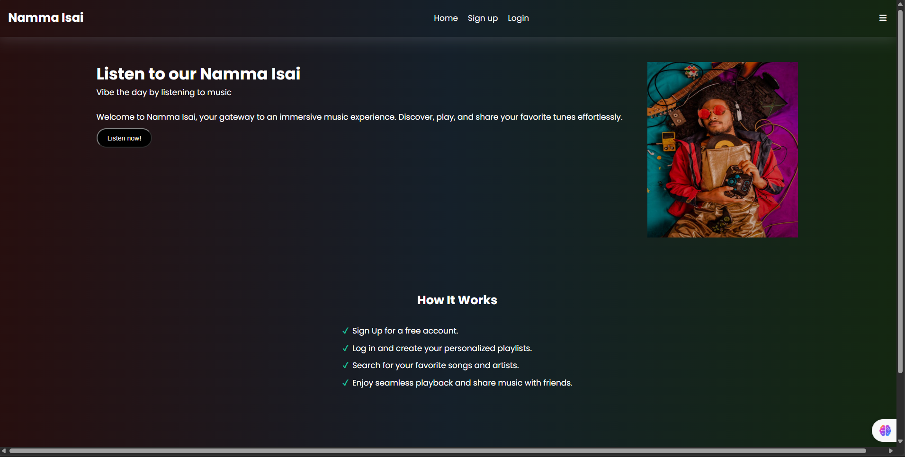
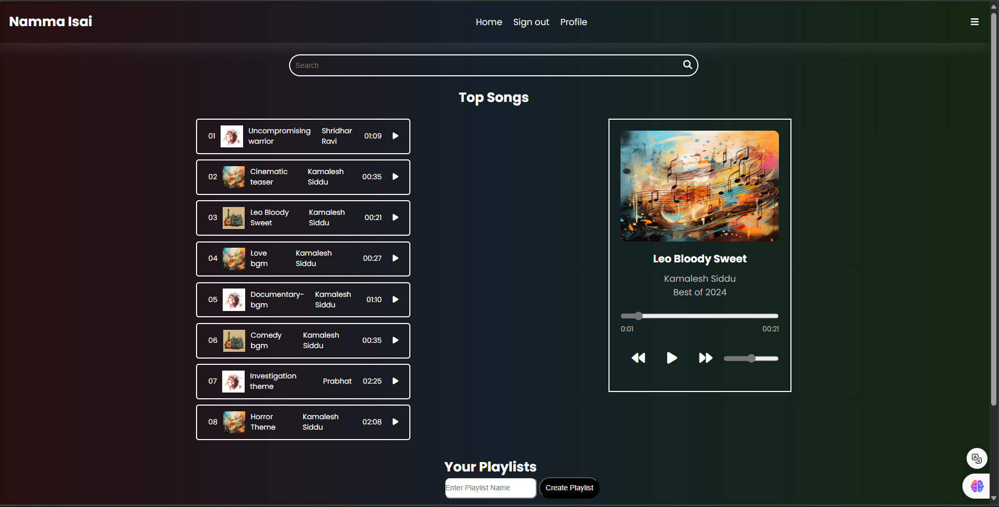

# 🎵 Namma Isai Music Player 🎧

**Namma Isai** is a **web-based music player** designed to provide an **easy and interactive** way to enjoy your favorite tracks! With its sleek and simple interface, users can **play, pause, search, and manage music effortlessly.** Whether on **desktop or mobile**, this player ensures an enjoyable musical experience for everyone. 🎶  

---

## ✨ Features

- **🎬 Play and Pause:** Start or stop your favorite track with just a click.  
- **⏩ Song Navigation:** Effortlessly skip to the next or previous track.  
- **🔊 Volume Control:** Adjust the audio to your preference.  
- **⏱️ Progress Bar:** Track how far along a song is and jump to any part instantly.  
- **🔍 Search Functionality:** Quickly find any song using the search bar.  
- **🗂️ Playlist Management:** Create, view, and delete your personalized playlists.  
- **📱 Responsive Design:** Optimized for both **desktop** and **mobile devices**.  

---

## 🛠️ Technologies Used  

- **HTML/CSS:** Structure and style for the web pages.  
- **JavaScript:** Core logic for interactivity and music playback.  
- **Firebase Authentication (Optional):** Handle user authentication securely.  
- **Firebase Firestore (Optional):** Store user playlists and other data.  
- **Local Storage:** Save music and settings directly on the user’s device without a database.  

---

## 🚀 Getting Started  

Follow these steps to set up **Namma Isai** on your local system:  

### Prerequisites  

- A **modern web browser** (Chrome, Firefox, Safari, etc.)  
- **Internet connection** (if using Firebase)  

### Installation  

1. **Clone the repository:**  
   ```bash
   git clone https://github.com/johnwesley755/namma-isai-music.git
   ```  

2. **Open the project directory:**  
   ```bash
   cd namma-isai
   ```  

3. **Launch the music player:**  
   Open the `index.html` file directly in your browser:  
   ```bash
   open index.html
   ```  

   Alternatively, you can open it via your browser’s **File > Open** option.

---

## 🎧 Usage  

- **Play Music:** Click the **Play button** to start a song. Click again to pause.  
- **Navigate Songs:** Use **Next** and **Previous** buttons to switch tracks.  
- **Adjust Volume:** Slide the **volume control** to your desired audio level.  
- **Search Songs:** Type in the **search bar** to filter songs by title.  
- **Manage Playlists:** Create, view, or delete playlists using the **sidebar menu**.

---

## 🖼️ Screenshots  

1. **Music Player UI:**  
     

2. **Playlist Management Feature:**  
   
   
---

## 🤝 Contributing  

We welcome contributions to **Namma Isai**! 🎉 If you have ideas or improvements, feel free to submit a pull request.  

### 📋 Steps to Contribute:  

1. **Fork** the repository.  
2. **Create** a new branch:  
   ```bash
   git checkout -b feature/YourFeature
   ```  
3. **Commit** your changes:  
   ```bash
   git commit -m 'Add new feature'
   ```  
4. **Push** the branch:  
   ```bash
   git push origin feature/YourFeature
   ```  
5. **Open** a pull request for review.  

---

## 🙌 Acknowledgements  

- **🎶 Huge thanks** to the artists whose music we enjoy through this player.  
- **👏 Special thanks** to everyone who contributed to improving Namma Isai.  

---

## 📩 Contact  

For questions, suggestions, or feedback, reach out to me at:  
📧 [johnwesley8113@gmail.com](mailto:johnwesley8113@gmail.com)

---

Enjoy using **Namma Isai** – your personal music companion! 🎧🎶  
